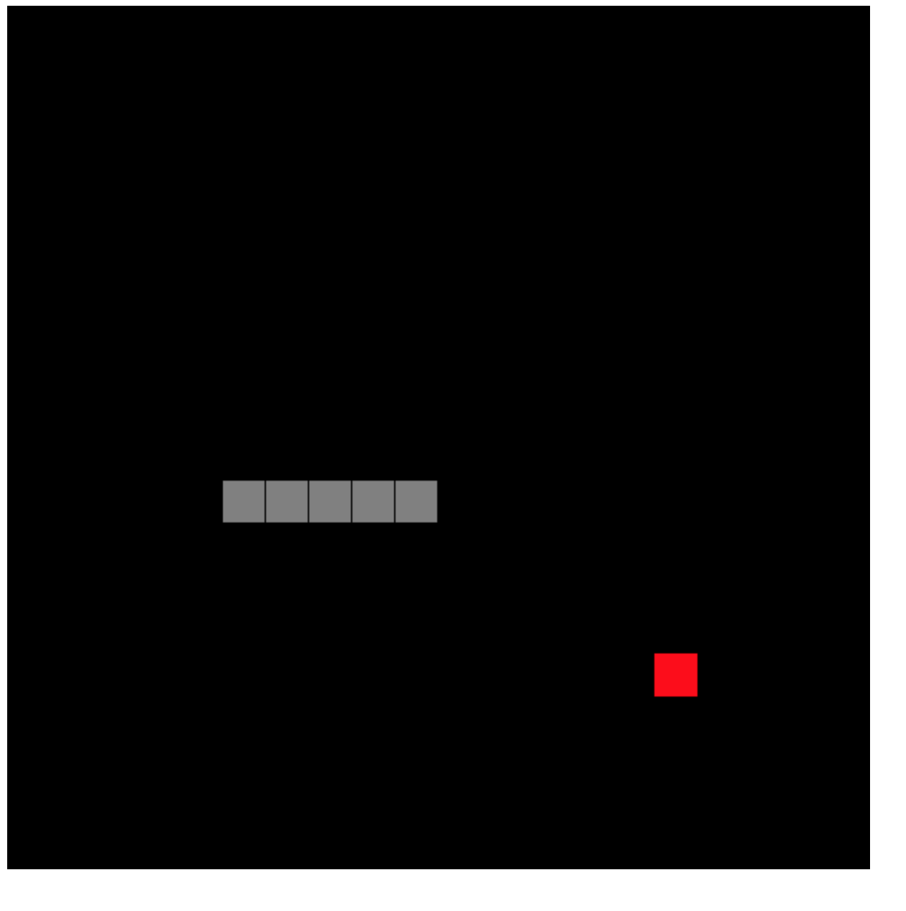

# JS Test for Frontend Developer

## Run the project

To run this project just run the command below in your shell:

1 - `git clone https://github.com/lucasspi/javascript-snake-game.git`

2 - `cd javascript-snake-game`

3 - Double click on `index.html` file

## Access Prototype
You can find the running prototype:
- [Access Running Prototype on AWS S3](https://snake-game.spirandeli.com) 
- [Access Running Prototype on Github.io](https://lucasspi.github.io/javascript-snake-game/)

